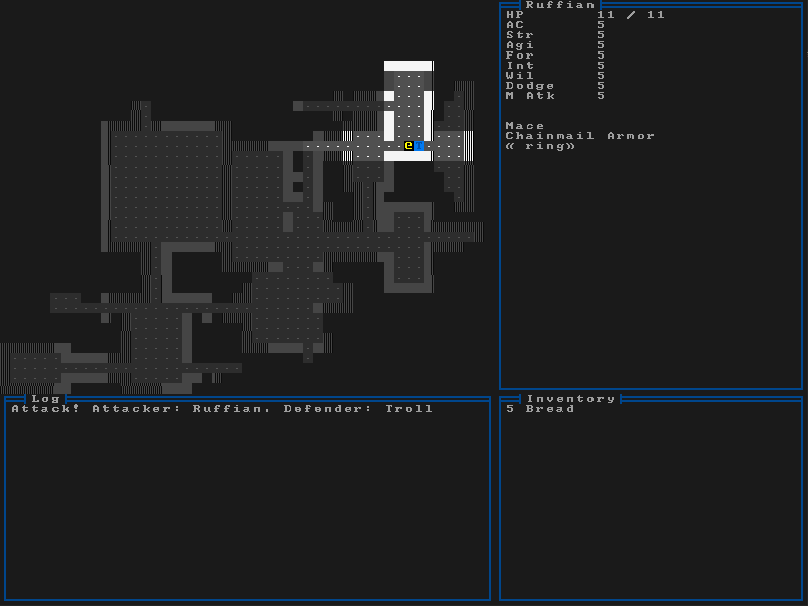

# Ruffian

> [!WARNING]
> Very WIP! I have no idea what I'm doing!

Barebones roguelike engine and game written from scratch using Odin and Raylib.

Features:
- Basic terminal emulator (80x60) and renderer supporting bitmap CP-437 fonts.
- Curses style batch rendering (in theory).
- Basic random level generation.
- Basic UI and message log system.
- Basic inventory and RPG stats system.

#### Screenshot of current progress
